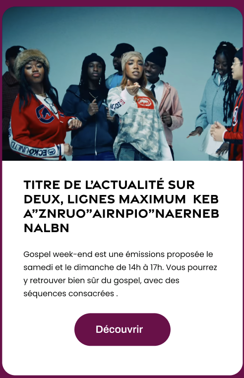

# Archive actualités
Afficher la liste des articles via wpgraphql

## Fonctionnalités
* Liste des articles sous forme de card
* Pouvoir filtrer par catégories

### Card article
Un item d'article est composé de : 
* image à la une
* Titre 
* Excerpt
* Bouton découvrir

## UI



*** background de la page *** #72004A
* Comme dans la page émission : grand titre `<h1 class="font-nav font-[900] text-[64px] md:text-[88px] leading-[90%] text-white text-center uppercase mb-10">Actualités</h1>`
* En desktop : 3 cards par ligne, en mobile Une card par ligne

## Styles
*** titre ***
``` css
color: #000;

/* Petit titre */
font-family: "Gravesend Sans Bold";
font-size: 20px;
font-style: normal;
font-weight: 700;
line-height: 110%; /* 22px */
```
*** Excerpt ****
```css
color: #0A0B0A;
font-family: Poppins;
font-size: 12px;
font-style: normal;
font-weight: 400;
line-height: 20px;
text-transform: lowercase;
```

*** Filtre ***
Comme dans la page émissions, chaque item du filtre un sous forme de pill, toutes les actualités sont affichées au début et pouvoir filtrer par catégorie