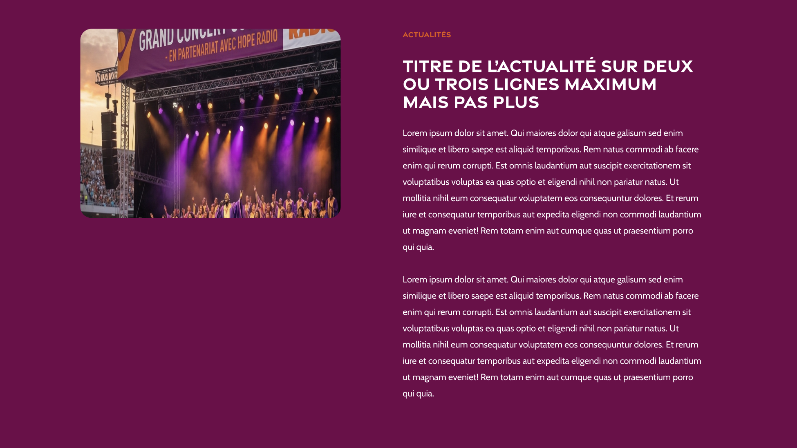

# Page article


## Objectif
Créer la page article contenant les elements suivants : 
* Image à la une
* catégorie
* titre de l'article
* contenu de l'article

Tout le contenu est dans le conteneur

## Styles
* background de la page : #72004A
* style du titre : 
```css
color: #FFF;

/* Sous-titre */
font-family: "Gravesend Sans";
font-size: 32px;
font-style: normal;
font-weight: 700;
line-height: 100%; /* 32px */
```
* style de la catégorie 
```css
color: #E35711;

/* Small text LABEL */
font-family: "Gravesend Sans";
font-size: 14px;
font-style: normal;
font-weight: 700;
line-height: 124%; /* 17.36px */
```
entre les elements il y a 30px de gap

* Image à la une : sur desktop width: 465px; et sur mobile occupe toute la largeur