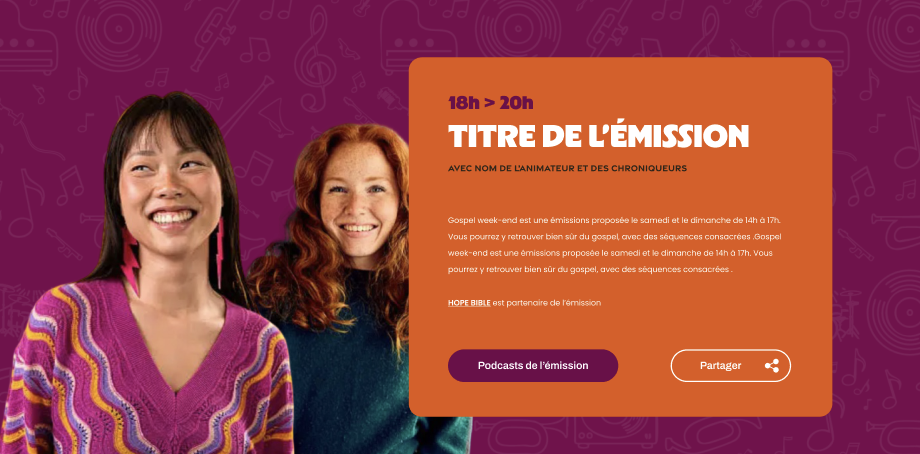

# Page d'une émission
Créer la page d'une émission composée d'une titre, l'horaire, le nom de l'animateur, la description et un bouton partager

*** Icone svg du bouton partager ***
```svg
<svg width="22" height="22" viewBox="0 0 22 22" fill="none" xmlns="http://www.w3.org/2000/svg">
<path d="M12.9296 15.654C11.1923 14.7853 9.45491 13.9166 7.69042 13.048C6.76746 14.2152 5.57304 14.8396 4.05287 14.7853C2.91274 14.731 1.96263 14.2967 1.1754 13.4823C-0.45336 11.7721 -0.371922 9.08465 1.31113 7.48304C3.07561 5.79999 6.03452 5.88143 7.69042 8.0531C8.23334 7.78164 8.77626 7.51019 9.29203 7.23873C10.4322 6.66866 11.5994 6.0986 12.7396 5.52853C12.8753 5.44709 12.9024 5.3928 12.8753 5.22993C12.2781 2.75964 13.8797 0.397948 16.3771 0.0450512C18.6845 -0.307846 20.9105 1.45664 21.1005 3.79119C21.3448 6.3972 19.2546 8.56888 16.6486 8.37886C15.4813 8.29742 14.5041 7.80879 13.744 6.91297C13.6897 6.83154 13.6082 6.77725 13.5539 6.69581C11.7895 7.56448 10.0521 8.43315 8.31478 9.32896C8.55909 10.1705 8.55909 10.9849 8.31478 11.7992C10.0793 12.6679 11.8166 13.5366 13.5539 14.4324C14.3683 13.3737 15.427 12.7765 16.73 12.6951C17.7616 12.6408 18.7117 12.9122 19.5261 13.5366C21.2091 14.8124 21.7249 17.0927 20.7205 18.9115C19.7161 20.7574 17.5715 21.5989 15.617 20.9474C13.7711 20.3231 12.1966 18.2328 12.9024 15.6811L12.9296 15.654Z" fill="white"/>
</svg>
```

## Structure
Image de l'émission à gauche et bloc de contenu à droite, l'image est légèrement translate vers la droite et en dessous du bloc emissioin selon l'UI.
La page a le même background image que le composant HeroSlider `@app/components/HeroSlider.tsx`

## UI


## Styles
* *Bloc de contenu
```css
display: inline-flex;
padding: 60px;
flex-direction: column;
justify-content: center;
align-items: flex-start;
gap: 20px;
background-color:#E45612
border-radius:30px
```
* horaire 
```css
color: #72004A;


/* H5 */
font-family: "Copyright Radosaw ukasiewicz, radluka.com";
font-size: 28px;
font-style: normal;
font-weight: 900;
line-height: 110%; /* 30.8px */
```
* Titre
```css
color: #FFF;

/* H4 */
font-family: "Copyright Radosaw ukasiewicz, radluka.com";
font-size: 48px;
font-style: normal;
font-weight: 900;
line-height: 83%; /* 39.84px */
```
* Nom des animateurs 
```css
color: #31251A;

/* Small text LABEL */
font-family: "Gravesend Sans";
font-size: 14px;
font-style: normal;
font-weight: 700;
line-height: 124%; /* 17.36px */
```
* Description
```css
color: #FFF;
font-family: Poppins;
font-size: 12px;
font-style: normal;
font-weight: 400;
line-height: 25px; /* 208.333% */
text-transform: capitalize;
```
