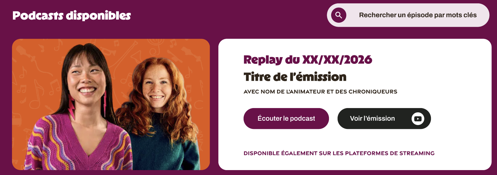

# Associer et afficher un podcast à une émission
Une emission peut avoir une ou plusieurs podcasts
## Relation
le flux rss du podcast contient des tags qui inclut le slug de l'emission
## Affichage
Dans la page d'une émission, afficher la liste des podcasts associés en bas
## UI


Dans la page emission on affiche l'image associée au podcast à gauche et les informations du podcast à droite, les deux blocs ont une gap de 20px et de border-radius de 10px.

Le bloc contenu à droite : 
* Titre du podcast dans le flux rss
```css
color: #72004A;

/* H5 */
font-family: "Copyright Radosaw ukasiewicz, radluka.com";
font-size: 28px;
font-style: normal;
font-weight: 900;
line-height: 110%; /* 30.8px */
```
* La description du podcast provenant du flux rss
```css
color: #31251A;

/* Small text LABEL */
font-family: "Gravesend Sans";
font-size: 14px;
font-style: normal;
font-weight: 700;
line-height: 124%; /* 17.36px */
```
* Un bouton Écouter le podcast de background #72004A et libellé en #FFFFFF, 
Le bouton affiche le lecteur déjà implémenté et lit l'audio associée au podcast dans le flux rss

Le gap entre le nom du podcast, sa description et le bouton est de 20px

## Ce qu'il faut faire
* Au clic sur un podcast dans la page catégorie des podcasts, afficher la page emission correspondante selon le tag dans le flux rss du podcast
* Afficher les podcasts liés à l'emission, une emission peut avoir plusieurs podcasts, créer donc un composant `PodcastEmissionItem`
* Au clic sur le bouton `Écouter le podcast` afficher le lecteur déjà en place pour lire le mp3 du podcast
